# Objectifs 

Dans ce lab nous voyons 2 approches de la récupération des métriques :

- mode **Pull** : un serveur central récupère les métriques, c'est le cas de Prometheus
- mode **Push** : sur chaque équipement, un agent exporte les métriques vers un serveur central, c'est le cas de Datadog

# Contenu

- [NodeExporter/Prometheus/Grafana](#nodeexporterprometheusgrafana)
    - [Utilisation de NodeExporter pour publier les métriques systèmes d’un serveur Linux](#nodeexporter)
    - [Installation de NodeExporter](#installation-de-nodeexporter-sur-un-autre-serveur)
    - [Collecte des métriques par Prometheus](#installation-dun-serveur-prometheus)
    - [Visualisation dans Grafana](#dashboard-grafana)
    - [Ajout de metric custom dans NodeExporter](#ajout-dune-metrique-custom-dans-nodeexporter)
    - [Instrumenter le code avec Prometheus](#instrumenter-le-code-pour-prometheus)

- [Datadog](#supervision-avec-datadog)
    - [Installation de l'agent Datadog](#installation-de-lagent-datadog)
    - [Recupération d'une metrique Custom](#metrique-custom-dans-datadog)


# NodeExporter/Prometheus/Grafana

On utilise 2 VMs :
- le serveur de supervision (`srv`) sur lequel on va installer `Prometheus` et `Grafana`
- le serveur supervisé (`clt`) sur lequel on va installer `NodeExporter`

Prometheus "scrappe" (c-a-d lit et analyse) les métriques sur les serveurs supervisés, les stocke dans sa TSDB, accessible pour Grafana.


## Installation d'un serveur `Prometheus`

Connectez-vous au serveur de supervision `srv` suivant les accès fournis par l'animateur.

Vérifions que le moteur `docker` est bien installé
```
docker version
```

Créeons le répertoire `/home/prometheus` :
```
mkdir /home/prometheus
cd /home/prometheus
```

Créeons dans ce répertoire le fichier ```docker-compose.yml``` ci-dessous qui définit le service `prometheus` :

```
services:
  prometheus:
    image: prom/prometheus
    container_name: prometheus
    restart: unless-stopped
    ports:
      - "9090:9090"
    volumes:
      - ./prometheus.yml:/etc/prometheus/prometheus.yml
      - prometheus-data:/prometheus
    command:
      - "--config.file=/etc/prometheus/prometheus.yml"
    networks:
      - monitoring

networks:
  monitoring:
    driver: bridge

volumes:
  prometheus-data:
```

Créeons le fichier de configuration  ```/home/prometheus/prometheus.yml``` :

```
global:
  scrape_interval: 10s

scrape_configs:
  - job_name: 'prometheus'
    static_configs:
      - targets: ['prometheus:9090']
```

Notez l'utilisation du nom `prometheus` qui sera résolu localement par Docker.

Lançons le serveur :
```
docker compose create
docker compose up -d
```

Naviguez sur la page Prometheus : http://IP_srv_prom:9090 , et explorez les métriques.

Par exemple, retrouvez la métrique qui donne le timestamp de lancement du service prometheus et affichez sa valeur et son graphe.

Autre exemple (cf [doc](https://prometheus.io/docs/prometheus/latest/querying/examples/)), aggrégez les visites des pages web par URI :
```
sum(prometheus_http_requests_total) by (handler)
```
ou par code retour :
```
sum(prometheus_http_requests_total) by (code)
```
ou lister les 3 URLs qui comptabilisent le plus de code 200
``` 
topk(3,prometheus_http_requests_total{code="200"})
```

## Installation de `NodeExporter` sur un autre serveur (`clt`)

Sur un autre serveur (appellons-le `clt`), installons `NodeExporter` :

Le mieux est de suivre cette [procédure](https://gist.github.com/nwesterhausen/d06a772cbf2a741332e37b5b19edb192)

NB : à l'heure de la rédaction de ces lignes, la dernière version est 1.8.2
NB2 : en debut d'étape 7. , tapez `systemctl enable node_exporter`


On pense à ouvrir le firewall pour le flux TCP/9100 entrant :
```
ufw allow 9100/tcp
```
Naviguez sur la page NodeExporter : http://IP_clt:9100/metrics 

## Supervision du serveur Linux `clt`

Sur le serveur Prometheus, modifier le fichier ```/home/prometheus/prometheus.yml```, afin d'y ajouter :

```
  - job_name: 'node-exporter'
    static_configs:
      - targets: ['IP_clt:9100']
```

NB : remplacer ```IP_clt``` par la véritable IP du serveur à superviser
NB2 : attention à bien respecter l'indentation du fichier YAML

Relancer prometheus :
```
cd /home/prometheus
docker compose restart
```
Naviguez sur la page Prometheus : http://IP_srv:9090/targets 

Requetez et graphez par exemple la metrique `node_network_receive_bytes_total`

### Ajout du service Grafana

Grafana va être executé sous la forme d'un container Docker.
Le plus simple et efficace consiste donc à étendre notre ```docker-compose.yml``` initial ainsi (c-a-d en insérant le bloc grafana et son volume) :

```
services:
  prometheus:
    image: prom/prometheus
    container_name: prometheus
    restart: unless-stopped
    ports:
      - "9090:9090"
    volumes:
      - ./prometheus.yml:/etc/prometheus/prometheus.yml
      - prometheus-data:/prometheus
    command:
      - "--config.file=/etc/prometheus/prometheus.yml"
    networks:
      - monitoring

  grafana:
    image: grafana/grafana-enterprise
    container_name: grafana
    restart: unless-stopped
    ports:
      - "3000:3000"
    volumes:
      - grafana-data:/var/lib/grafana
    networks:
      - monitoring

networks:
  monitoring:
     driver: bridge

volumes:
  prometheus-data:
  grafana-data:
```

Relancons docker-compose :
```
docker compose create
docker compose up -d
```

Consultons l'interface web de Grafana en HTTP sur le port 3000 avec les creds admin/admin : http://IP_srv:3000

- Aller dans le menu sur la gauche and sélectionner “Connections / Data Sources.”
- Clicquer sur “Add your  data source.”
- Choisir “Prometheus” dans la liste
- Renseigner l'URL http://prometheus:9090 (prometheus est résolu en interne par docker)
- Cliquer sur  “Save & Test” pour vérifier la connection.

## Dashboard Grafana

- Chercher dans la page [Grafana Dashboard](https://grafana.com/grafana/dashboards/) le dashboard ”Node Exporter Full”.
- Copier le dashboard ID. Dans notre cas, l'ID est 1860.
- De retour sur *notre* Grafana, sur la gauche, cliquer sur  “Dashboard” puis le bouton bleu enn haut à gauche "New" : dans cette list déroulante, sélectionner “Import”
- Dans la section “Grafana.com Dashboard” , copier le dashboard ID (1860) dans le champ “Grafana.com Dashboard ID” .
- Cliquer sur le bouton “Load” , sélectionner *notre* prometheus dans le champ (liste déroulante)

Naviger dans la section des Dashboard.... 

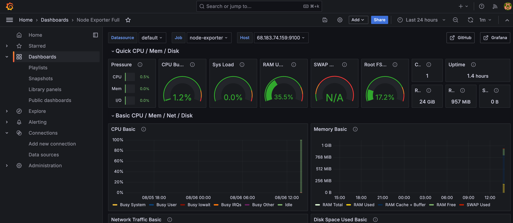

## Ajout d'une metrique custom dans NodeExporter

Sur le serveur supervisé (`clt`) :

```
mkdir /home/textfile
```

Configurez NodeExporter pour prendre en compte ce répertoire , modifiant la ligne suivante dans `/etc/systemd/system/node_exporter.service`:
```
ExecStart=/opt/node_exporter/node_exporter --collector.textfile.directory=/home/textfile
```

Puis relançons NodeExporter :
```
systemctl daemon-reload
systemctl restart node_exporter.service  
```

Créeons (à la main) un fichier contenant notre metrique custom (dont la valeur vaut le nombre de secondes depuis l'epoch):
```
echo ma_metrique_custom $(date +%s) > /home/textfile/ma_metrique_custom.prom
```

Naviguez sur la page NodeExporter : http://IP_clt:9100/metrics  et constatez que notre métrique est incluse dans la page !
```
curl -s http://IP_clt:9100/metrics | grep "ma_metrique_custom"
# HELP ma_metrique_custom Metric read from /home/textfile/ma_metrique_custom.prom
# TYPE ma_metrique_custom untyped
ma_metrique_custom 1.722946125e+09
node_textfile_mtime_seconds{file="ma_metrique_custom.prom"} 1.722946125e+09
```

Cette métrique doit également être consutable sur Prometheus directement : http://IP_srv_prom:9090

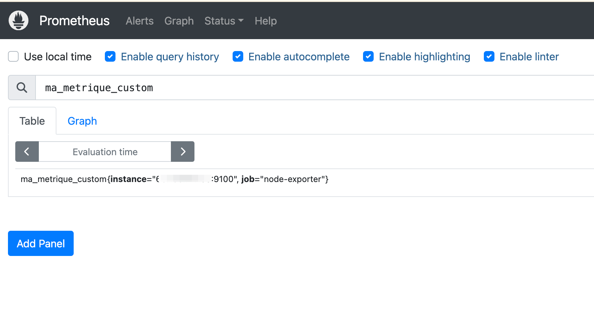

Plus de détails [ici](https://github.com/prometheus-community/node-exporter-textfile-collector-scripts)

Notez la mention de ```spunge``` afin d'écrire atomiquement le fichier ```textfile```.

## Instrumenter le Code pour Prometheus

Sur `clt`, nous allons instrumenter  une application API écrite en python avec flask :

```
apt install -y python3-prometheus-client python3-flask
```

Puis copier le code suivant dans l'invite `python3` (ne pas oublier de faire 2 retours chariots à la fin) :

```
from flask import Flask, request, render_template_string
from prometheus_client import start_http_server, Counter, Histogram, generate_latest
from prometheus_client.core import CollectorRegistry
import time
import random

# Initialiser l'application Flask
app = Flask(__name__)

# Crée un compteur pour les appels de fonction
REQUEST_COUNT = Counter('my_function_request_count', 'Total number of requests to my_function')

# Crée un histogramme pour les temps d'exécution
REQUEST_LATENCY = Histogram('my_function_request_latency_seconds', 'Latency of requests to my_function in seconds')

# Décorateur pour mesurer les métriques
def metric_decorator(func):
    def wrapper(*args, **kwargs):
        REQUEST_COUNT.inc()  # Incrémente le compteur de requêtes
        with REQUEST_LATENCY.time():  # Mesure le temps d'exécution de la fonction
            result = func(*args, **kwargs)
        return result
    return wrapper

@metric_decorator
def my_function():
    # Simule une tâche longue avec un temps d'exécution aléatoire
    time.sleep(random.uniform(0.1, 0.5))
    return "Function is complete."

@app.route('/')
def index():
    # Appel de la fonction décorée
    message = my_function()
    return render_template_string("<h1>{{ message }}</h1>", message=message)

@app.route('/metrics')
def metrics():
    # Exposer les métriques au format texte brut pour Prometheus
    return generate_latest()

if __name__ == '__main__':
    # Démarre un serveur HTTP pour exposer les métriques sur le port 8000
    start_http_server(8000)
    
    # Démarre l'application Flask sur toutes les interfaces réseau (0.0.0.0) sur le port 5000
    app.run(host='0.0.0.0', port=5000)
```

Visiter le site web  http://IP_clt:5000 (l'application)

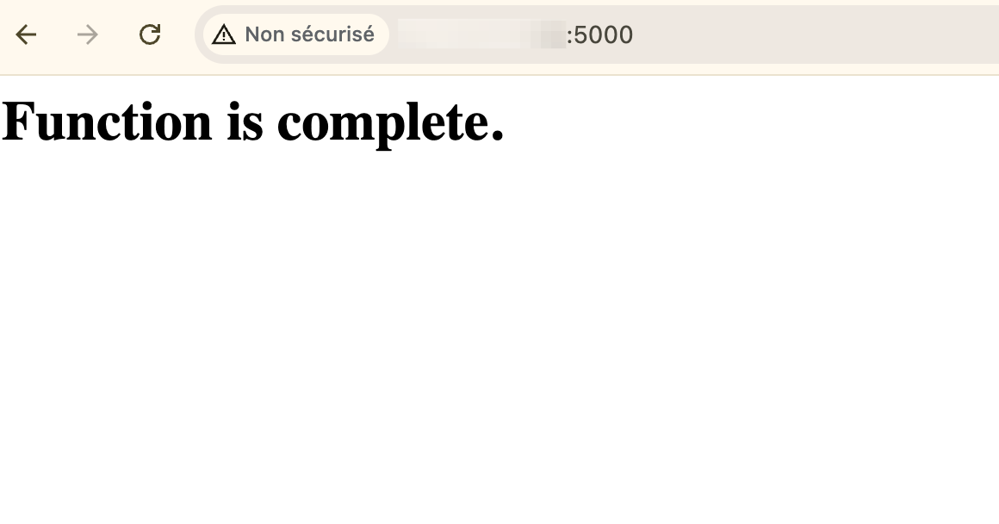

puis le site http://IP_clt:8000  (les métriques Prometheus) 

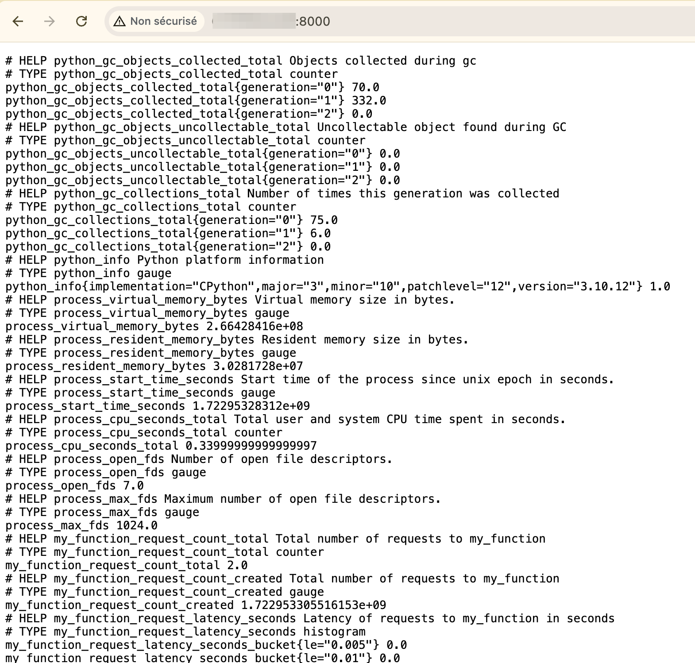


# Supervision avec Datadog

## Installation de l'agent Datadog

Créez un compte (gratuit) sur [Datadog](http://datadog.com)

Suivez la procédure d'[installation d'un agent systeme](https://app.datadoghq.eu/account/settings/agent/latest?platform=overview) (Integration > Agent) avec la création à la volée d'une clé API.

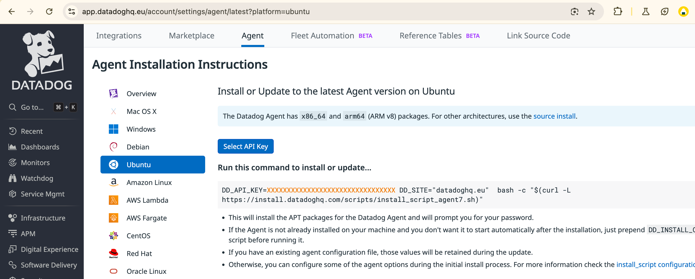

Au bout de quelques minutes, votre serveur va aparaitre dans le portail DataDog, menu à gauche "Infrastructure > Hosts"

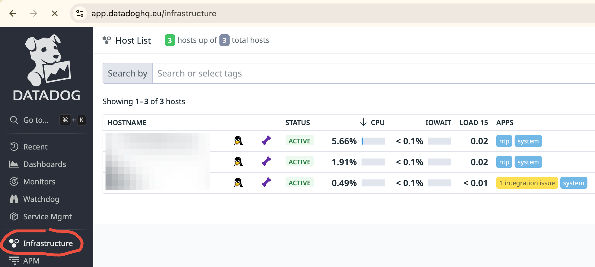

Vous pouvez créer une alerte (monitor) sur cette [page](https://app.datadoghq.eu/monitors/create) en choisissant par exemple la metrique ```system.disk.free``` ou autre...)

## Metrique custom dans Datadog

Supposons que nous souhaitions connaitre le nombre de lignes dans les tables d'une base de données.

### Installation d'une base de données sur le serveur supervisé

Sur notre serveur `clt` :

```
apt install -y mariadb-server unzip
```

Injection d'une base de données nommée `classicmodels`

```
cd /home/
wget https://www.mysqltutorial.org/wp-content/uploads/2023/10/mysqlsampledatabase.zip
unzip mysqlsampledatabase.zip
```

Puis (mot de passe vide)
```
mysql -u root -p
```
Ce qui donne 
```
Enter password: ********
mysql>
```

Enfin, importons le fichier de base de données et configurons le mdp root mysql
```
> source mysqlsampledatabase.sql;
> show databases;
+--------------------+
| Database           |
+--------------------+
| classicmodels      |
| information_schema |
| mysql              |
| performance_schema |
| sys                |
+--------------------+
> ALTER USER 'root'@'localhost' IDENTIFIED BY 'MyN3wP4ssw0rd';
> flush privileges;
> exit;
```

### Configuration de l'agent Datadog

Sur le serveur supervisé (i.e `clt`):
```
cd /etc/datadog/conf.d/mysql.d
```

Renommer le fichier `conf.yaml.sample` en `conf.yaml` et injecter (en faisant attention aux indentations) quelque chose comme ceci:

```
init_config:
instances:
  - host: localhost
    dbm: true
    username: root
    password: MyN3wP4ssw0rd
    port: 3306

    custom_queries:
      - query: SELECT COUNT(*) FROM classicmodels.customers
        columns:
         - name: classicmodels.customers
           type: gauge
      - query: SELECT COUNT(*) FROM classicmodels.employees
        columns:
         - name: classicmodels.employees
           type: gauge
      - query: SELECT TABLE_NAME, TABLE_ROWS FROM information_schema.TABLES WHERE TABLE_SCHEMA = 'classicmodels'
        columns:
         - name: classicmodels.table_name
           type: tag
         - name: classicmodels.table_rows
           type: gauge
```

Relancer l'agent datadog et vérifier que la plugin SQL est sans erreur :

```
systemctl restart datadog-agent
```
Lancer plusieurs fois l'outil de diagnostic jusqu'à ce que le paragraphe MySQL soit ok :
```
# datadog-agent status | grep -A10 -i mysql 
    mysql (12.5.1)
    --------------
      Instance ID: mysql:4bf5f516622ead61 [OK]
      Configuration Source: file:/etc/datadog-agent/conf.d/mysql.d/conf.yaml
      Total Runs: 1
      Metric Samples: Last Run: 69, Total: 69
      Events: Last Run: 0, Total: 0
      Database Monitoring Metadata Samples: Last Run: 1, Total: 1
      Service Checks: Last Run: 1, Total: 1
      Average Execution Time : 533ms
      Last Execution Date : 2024-08-07 06:09:51 UTC (1723010991000)
      Last Successful Execution Date : 2024-08-07 06:09:51 UTC (1723010991000)


```

Ensuite aller dans Datadog :
- activer l'intégration MySQL

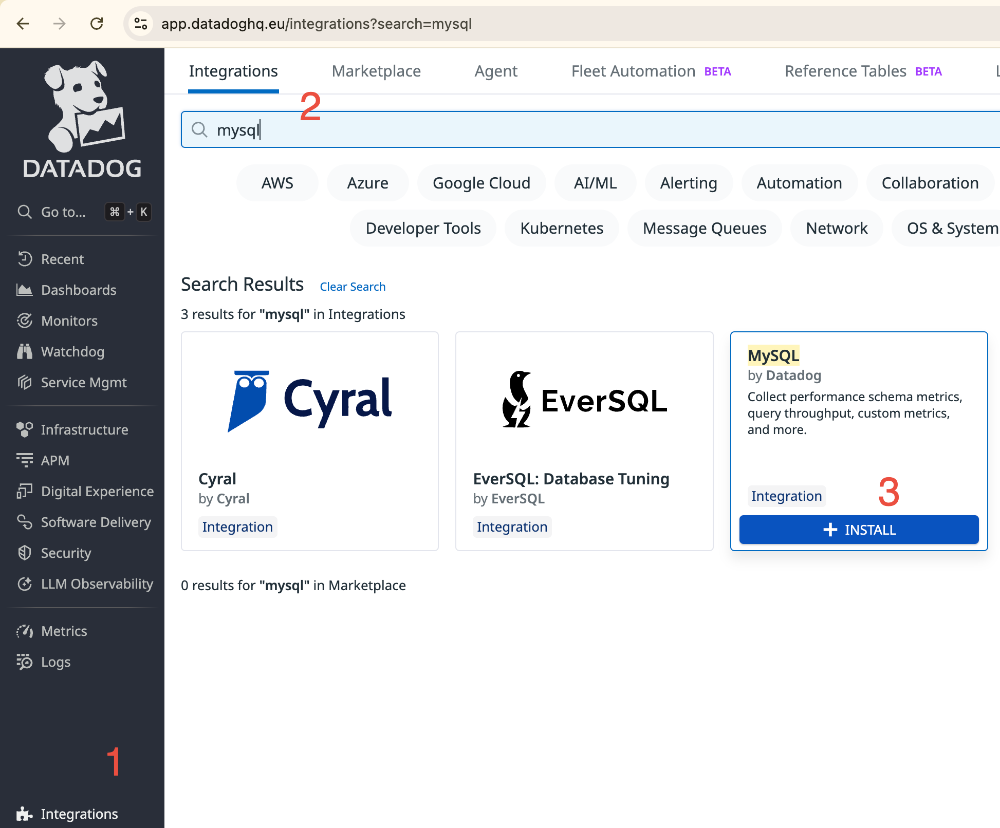

- explorer les métriques (menu "Metric Explorer" à gauche)

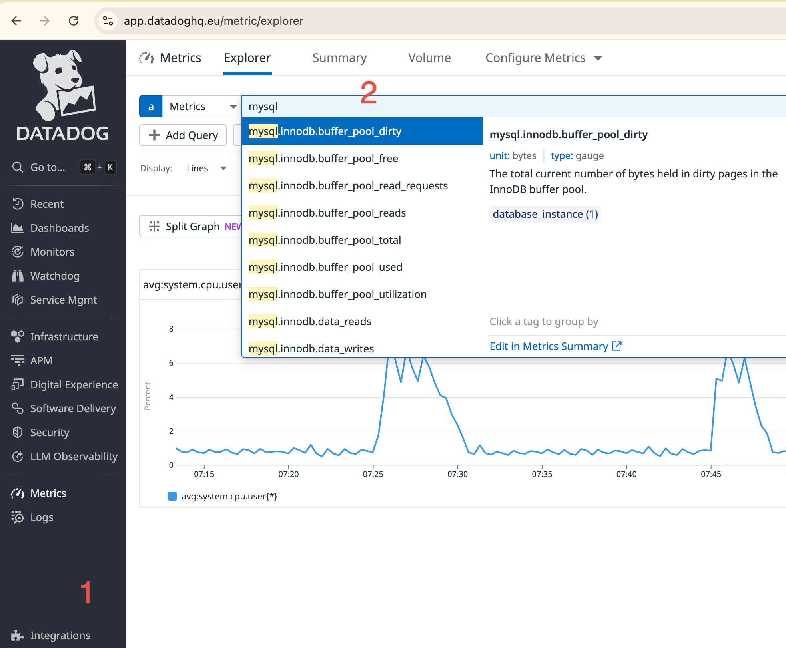

- retrouver nos 2 métriques custom :

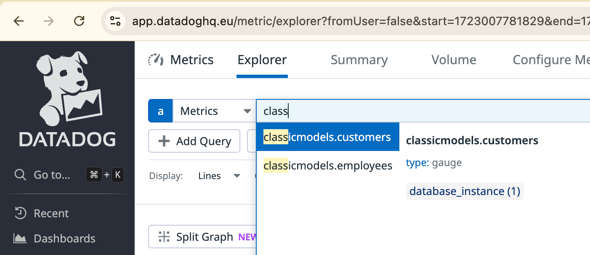

- dans un Dasboard, ajouter 2 graphes montrant le nombre de customers et d'employes

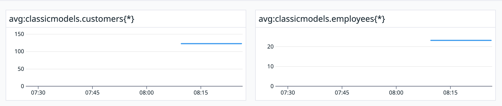

- puis construisez un TopList qui montre le nombre de lignes par table dans notre database 'classimodels' :

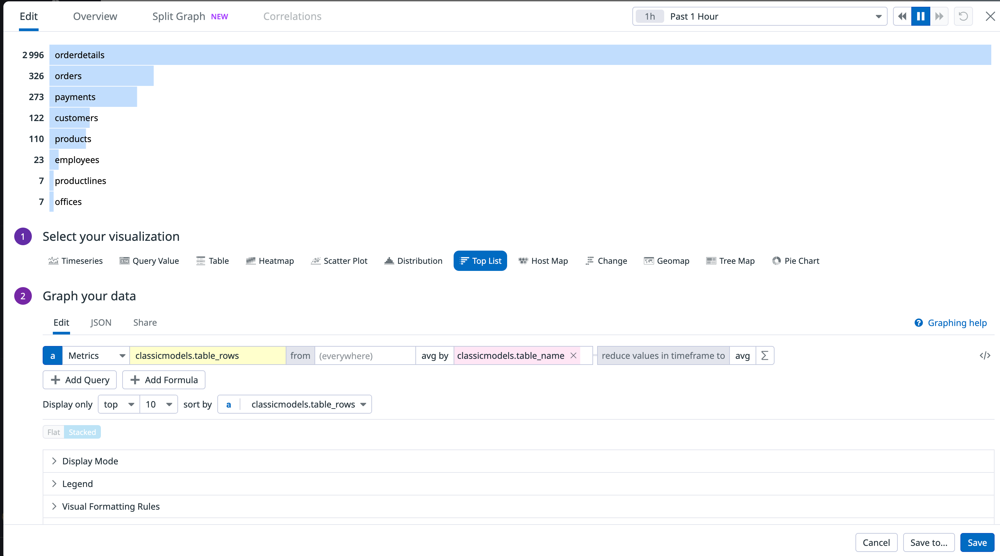

Soit

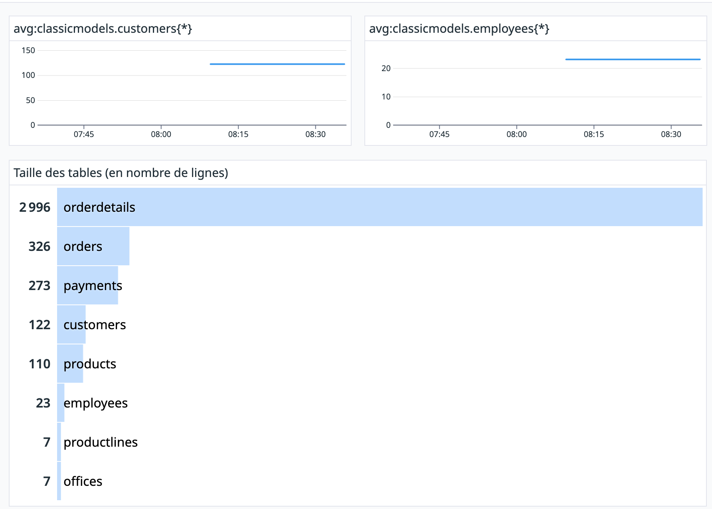